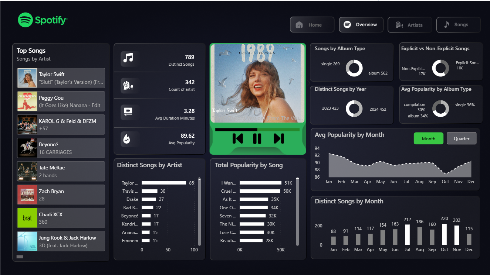

# 🎵 Spotify Music Analysis Dashboard — Power BI

## 📊 Project Overview

This project presents an interactive **Spotify Music Analysis Dashboard** developed in Microsoft Power BI.

The dashboard analyzes songs, artists, popularity, album types, release trends, and song performance to provide a clear view of the music dataset.

## 🎯 Project Objectives

- Analyze the number of distinct songs and artists
- Identify popular artists and songs
- Analyze song popularity
- Compare album types
- Analyze explicit vs non-explicit songs
- Examine songs by year and month
- Analyze average popularity trends
- Identify artists with the most No. 1 hits

## 📌 Key KPIs

- **Distinct Songs:** 789
- **Artists:** 342
- **Average Duration:** 3.28 minutes
- **Average Popularity:** 89.62

## 📈 Dashboard Highlights

- Top Songs
- Distinct Songs by Artist
- Total Popularity by Artist
- No. 1 Hits by Artist
- Songs by Album Type
- Explicit vs Non-Explicit Songs
- Distinct Songs by Year
- Average Popularity by Album Type
- Average Popularity by Month
- Song Details Table

## 🛠️ Tools & Skills

**Power BI | Power Query | DAX | Data Cleaning | Data Modeling | Data Visualization | Dashboard Design**

## 📷 Dashboard Preview

## 📂 Dataset

The analysis uses the Spotify Top 50 World dataset.

## 👤 Author

**Somya Singhal**
